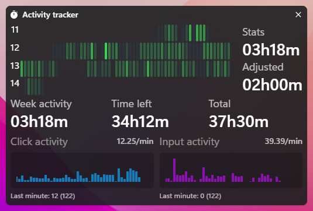

<h1 align="center">
<br>

<br>
Activity Tracker
</h1>

<h4 align="center">Custom work activity tracker with <a href="https://tauri.app/" target="_blank">Tauri</a>, <a href="https://www.rust-lang.org/" target="_blank">Rust</a> and <a href="https://kit.svelte.dev/" target="_blank">SvelteKit</a></h4>
<br>

<div align="center">
    
</div>

## How to develop

Recommended IDE Setup:

- [VS Code](https://code.visualstudio.com/) + [Tauri](https://marketplace.visualstudio.com/items?itemName=tauri-apps.tauri-vscode) + [rust-analyzer](https://marketplace.visualstudio.com/items?itemName=rust-lang.rust-analyzer)

Prepare your environment: follow the guide from https://tauri.app/v1/guides/getting-started/prerequisites.

Install JS and Rust dependencies

```
pnpm install && cd src-tauri && cargo build
```

Start dev command from root project

```
cargo tauri dev
```
depends on the package manager used to install tauri CLI.